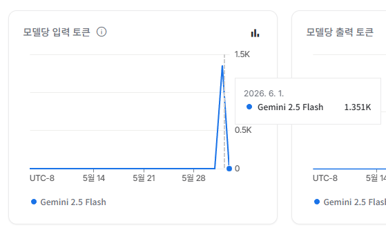
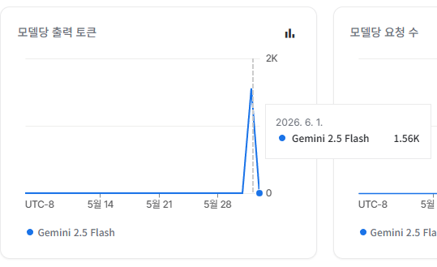
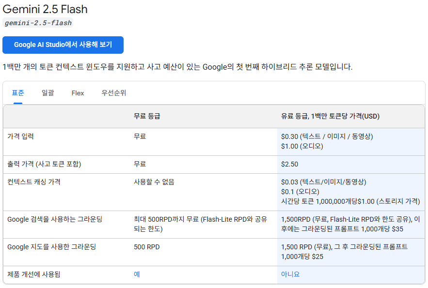

# K-CBCL 스마트 브리핑 AI 분석 파이프라인

이 프로젝트는 아동·청소년 행동평가척도(**K-CBCL**)의 PDF 결과 보고서를 파싱하여 정형 데이터로 구조화하고, 생성형 AI(Gemini)를 통해 전문 의학 용어를 배제한 따뜻한 보호자 맞춤형 리포트와 양육 가이드를 자동 매칭해 주는 솔루션입니다.

---

## 주요 기능
- **PDF 파싱**: `pdfplumber`를 이용해 복잡한 표와 구조를 가진 CBCL PDF에서 이름, 성별, 나이 및 임상 지표 T-점수를 정밀 추출합니다.
- **개인정보 보호 (마스킹)**: 외부 LLM API 전송 시 개인정보 노출을 방지하기 위해 아동 이름을 자동으로 익명화(`김인사` ➔ `김*사`)합니다.
- **AI 스마트 요약**: 진단명 노출을 엄격히 통제하고 보호자가 이해하기 쉬운 따뜻한 어조로 분석 및 해설을 제공합니다.
- **맞춤형 양육 가이드 매핑**: 아동의 검사 수치(T-점수) 중 가장 위험군에 속하는 지표를 식별하여 관련 양육 팁 및 상담 전용 추천 질문을 자동으로 로드하여 결합합니다.

---

## 실행 환경 설정

### 시스템 요구 사항
- **OS**: Windows, macOS, Linux
- **Python 버전**: `Python 3.9` 이상 권장 (개발 및 테스트 환경: `Python 3.12.4`)
- **Docker 베이스 이미지**: `continuumio/miniconda3:latest` (Miniconda3 기반 실행 환경 제공)
- **필수 패키지**: `pdfplumber`, `python-dotenv`, `google-generativeai`, `fpdf2`

### 주요 환경 변수

| 환경 변수명      | 설정 위치 | 설명                                                          |
| :--------------- | :-------- | :------------------------------------------------------------ |
| **`AI_API_KEY`** | `.env`    | Google AI Studio의 Gemini API 호출을 위한 필수 인증 키입니다. |


### 로컬 설정 예시 (`.env`)
```env
AI_API_KEY=발급받은_Gemini_API_키
```

---

## 실행 방법

### 0. 데이터 준비
```
1. input 폴더에 [AI개발자_테스트자료_CBCL보고서.pdf] 파일
2. .env 파일에 Gemini API 키 입력
```

### 1. 로컬 개발 환경 실행
```bash
conda create -n imomtae python=3.12 -y
conda activate imomtae

pip install -r requirements.txt

python main.py
```

### 2. 도커(Docker) 환경 실행


```bash
docker build -t imomtae .
```

이미지 빌드가 완료되면 아래 단축 명령어를 통해 실행할 수 있습니다:

- **Windows (PowerShell)**:
  ```powershell
  docker run --rm -v "${PWD}/input:/app/input" -v "${PWD}/output:/app/output" -v "${PWD}/data_base/user_data:/app/data_base/user_data" --env-file .env imomtae
  ```
- **Windows (CMD)**:
  ```cmd
  docker run --rm -v "%cd%/input:/app/input" -v "%cd%/output:/app/output" -v "%cd%/data_base/user_data:/app/data_base/user_data" --env-file .env imomtae
  ```
- **macOS / Linux**:
  ```bash
  docker run --rm -v "$(pwd)/input:/app/input" -v "$(pwd)/output:/app/output" -v "$(pwd)/data_base/user_data:/app/data_base/user_data" --env-file .env imomtae
  ```


---

## AI 모델 및 비용 안내

| 항목                | 상세 정보                                                                                                                                                                                    |
| :------------------ | :------------------------------------------------------------------------------------------------------------------------------------------------------------------------------------------- |
| **사용 모델 / API** | Google AI Studio `gemini-2.5-flash`                                                                            |
| **보안 주의사항**   | 무료 버전 키를 사용하는 경우 전송 데이터가 Google 학습 데이터로 활용될 수 있으므로, 내부 코드에서 **이름 마스킹 알고리즘**을 상시 적용하고 있습니다.                                         |
| **예상 비용**       | **0원 (무료 티어 기준)** <br> - 분당 최대 15회 호출(15 RPM) 및 일일 1,500회 호출(1,500 RPD) 한도 무료 제공 <br> - 종량제(Paid Tier) 전환 시에도 100만 토큰당 약 $0.1 수준으로 극히 저렴함    |
| **선택 근거**       | 비식별화가 완료된 데이터의 '일상 언어 번역'이나 '질문 요약' 작업은 고도의 논리 연산이 필요하지 않으므로, 비용이 매우 저렴한 경량 모델(예: GPT-5.4-mini 등) API로 대체하여 유지비를 대폭 절감 |

#### 토큰 단가 및 비용 기준 안내 (gemini-2.5-flash)
|             input 토큰 단가              |              output 토큰 단가              |               전체 요금표                |
| :--------------------------------------: | :----------------------------------------: | :--------------------------------------: |
|  |  |  |


---

## 기술 및 데이터 흐름

```
    [K-CBCL PDF 입력]
    -> [pdfplumber 파싱]
    -> [데이터 비식별화 및 마스킹 - 김*사]
    -> [정형 JSON 데이터 구조화]
    -> [Gemini 2.5 Flash API 호출]
    -> [AI 요약 생성 및 가이드 ID 추천]
    -> [자체 가이드 DB 매핑]
    -> [마크다운 리포트 생성 및 저장]
```

1. **PDF 파싱 및 데이터 추출**: `pdfplumber`를 활용하여 K-CBCL 결과 보고서에서 임상적 의미를 지니는 T-점수와 아동 인적 사항을 룰 기반으로 정밀 크롤링합니다.
2. **데이터 구조화 및 비식별화**: 추출된 데이터를 JSON 포맷으로 정형화하며, 아동 이름은 마스킹 처리하여 API 전송 데이터 안정성을 확보합니다.
3. **LLM API 호출**: 프롬프트 엔지니어링을 통하여 진단명을 배제한 친절한 설명 번역 및 내부 양육 가이드 ID 추천을 처리합니다.
4. **콘텐츠 매핑 및 출력**: 반환된 AI 요약문과 데이터베이스에서 불러온 추천 양육 가이드 본문을 통합하여 마크다운 리포트(`output/CBCL_스마트_브리핑.md`, `output/CBCL_스마트_브리핑.pdf`)로 최종 저장합니다.

## 📦 입출력 산출물 (Artifacts)

프로젝트 실행에 필요한 입력 파일 및 환경 설정과, 실행 후 생성되는 주요 결과물에 대한 상세 명세입니다.

### 📥 1. 입력 데이터 및 설정 (Inputs)
| 위치 | 파일/설정 명칭 | 유형 | 설명 |
| :--- | :--- | :---: | :--- |
| `input/` | `AI개발자_테스트자료_CBCL보고서.pdf` | PDF 파일 | 대상 아동의 K-CBCL 결과 보고서 원본 파일 |
| 루트 (`./`) | `.env` | 설정 파일 | Gemini API 연동을 위한 인증 키 (`AI_API_KEY=...`) |

### 📤 2. 최종 출력 파일 (Outputs)
| 위치 | 파일명 패턴 | 유형 | 설명 |
| :--- | :--- | :---: | :--- |
| `output/` | `{입력파일명}_스마트_브리핑.md` | Markdown | 요약 브리핑 및 추천 육아 가이드가 포함된 마크다운 보고서 |
| `output/` | `{입력파일명}_스마트_브리핑.pdf` | PDF | 보호자 제공용으로 레이아웃과 폰트가 포맷팅된 PDF 파일 |
| `data_base/user_data/` | `{입력파일명}.json` | JSON | PDF 파싱 및 비식별화(마스킹) 처리가 완료된 정형 데이터 |
